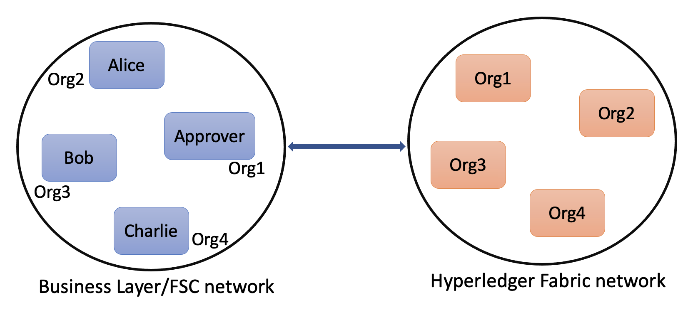

# I Owe yoU eXtended (IOUX)

In this section, we will extend the original [`I O(we) (yo)U`](../iou/README.md) sample to include multiple participants (`Alice`, `Bob`, and `Charlie`). Any of the parties can be a `lender` or a `borrower`.
We still maintain the same `approver` who mediates between the parties and validate transaction operations.

## Business States

We model a business state that represents the amount of money one party owes another.

This is represented by the business state in [`state.go`](./states/state.go).

```go
// IOU models the IOU state
type IOU struct {
	// Amount the borrower owes the lender
	Amount   uint
	// Unique identifier of this state
	LinearID string
	// The list of owners of this state
	Parties  []view.Identity 
}
```

## Business Processes or Interactions

### Create the IOU State

The first operation is to create the IOU state.
The borrower is the initiator of the interactive protocol to create this state. It must provide both the `amount` and `lender` as input.
The borrower executes the view in [`borrower.go`](./views/borrower.go):

```go
// Create contains the input to create an IOU state
type Create struct {
	// Amount the borrower owes the lender
	Amount uint
	// Lender is an identifier of the recipient identity
	Lender string
	// Approver is the identity of the approver's FSC node
	Approver view.Identity
}
```

The lender responds to request of endorsement from the borrower running the view in [`lender.go`](./views/lender.go)

The approver runs the following view in [`approver.go`](./views/approver.go) to respond to the request of signature from the borrower.

### Update the IOU State

Once the IOU state has been created, the parties can agree on the changes to the state
to reflect the evolution of the amount the borrower owes the lender.

```go
// Update contains the input to update an IOU state
type Update struct {
	// LinearID is the unique identifier of the IOU state
	LinearID string
	// Amount is the new amount. It should smaller than the current amount
	Amount uint
	// Approver is the identity of the approver's FSC node
	Approver view.Identity
}
```

## Testing

To run the `IOUX` sample, we need to first deploy the `Fabric Smart Client nodes` and the `Fabric network`.
Once these networks are deployed, we can invoke views on the smart client nodes to test the sample.



### Network topology description

For Fabric, we define a topology with the following characteristics:
1. Four organization: Org1, Org2, Org3, and Org4;
2. Single channel;
2. A namespace `ioux` whose changes can be endorsed by endorsers from Org1.

For the FSC network, we have a topology with:
1. 4 FCS nodes. Each one for the `approver`, `alice`, `bob`, and `charlie`.
2. The approver's FSC node has an additional Fabric identity belonging to Org1, thereby acting as an endorser of the Fabric namespace we defined above.

The network topology is described programmatically in [`topology.go`](./topology/topology.go)


### Boostrap the networks

To build the networks, we need to run the following commands from the folder `$GOPATH/src/github.com/hyperledger-labs/fabric-smart-client/samples/fabric/ioux`.

```shell
go build -o ioux
```

If the compilation is successful, we can run the `ioux` command line tool as follows:

``` 
./ioux network start --path ./testdata
```

The above command will start the Fabric network and the FSC network, 
and store all configuration files under the `./testdata` directory.
The CLI will also create the folder `./cmd` that contains a go main file for each FSC node.
The CLI compiles these go main files and then runs them.

If everything is successful, you will see something like the following:

```shell
2022-02-08 11:53:03.560 UTC [fsc.integration] Start -> INFO 027  _____   _   _   ____
2022-02-08 11:53:03.561 UTC [fsc.integration] Start -> INFO 028 | ____| | \ | | |  _ \
2022-02-08 11:53:03.561 UTC [fsc.integration] Start -> INFO 029 |  _|   |  \| | | | | |
2022-02-08 11:53:03.561 UTC [fsc.integration] Start -> INFO 02a | |___  | |\  | | |_| |
2022-02-08 11:53:03.561 UTC [fsc.integration] Start -> INFO 02b |_____| |_| \_| |____/
2022-02-08 11:53:03.561 UTC [fsc.integration] Serve -> INFO 02c All GOOD, networks up and running
```

To shut down the networks, just press CTRL-C.

If you want to restart the networks after the shutdown, you can just re-run the above command.
If you don't delete the `./testdata` directory, the network will be started from the previous state.

Before restarting the networks, one can modify the business views to add new functionalities, to fix bugs, and so on.
Upon restarting the networks, the new business views will be available.

To clean up all artifacts, we can run the following command:

```shell
./ioux network clean --path ./testdata
```

The `./testdata` and `./cmd` folders will be deleted.

## Invoke the business views

### Create IOU
To create an IOU with amount 50 between `alice` and `bob`, we can run the following command in a new terminal window:

```shell
./ioux view -c ./testdata/fsc/nodes/alice/client-config.yaml -f create -i "{\"Amount\":50, \"Lender\":\"bob\"}"
```

The above command invoke the `create` view on the `Alice's` FSC node. The `-c` option specifies the client configuration file.
The `-f` option specifies the view name. The `-i` option specifies the input data. Lender information must be part of the input data, since we have removed default lender.
If everything is successful, you will see something like the following:

```shell
"7f536750-80aa-4c74-8580-16b62a983719"
```
The above is the IOU ID that we will use to update the IOU or query it. We can query the IOU by running the following command on `alice's` FSC node:

```shell
./ioux view -c ./testdata/fsc/nodes/alice/client-config.yaml -f query -i "{\"LinearID\":\"7f536750-80aa-4c74-8580-16b62a983719\"}"
```

We can also query the same IOU on `bob's` node using the following command:

```shell 
./ioux view -c ./testdata/fsc/nodes/bob/client-config.yaml -f query -i "{\"LinearID\":\"7f536750-80aa-4c74-8580-16b62a983719\"}"
```

Now, lets create an IOU with amount 40 between `bob` and `charlie` using the following command:

```shell
./ioux view -c ./testdata/fsc/nodes/bob/client-config.yaml -f create -i "{\"Amount\":40, \"Lender\":\"charlie\"}"
```

We can query the IOU by running the following command:

```shell 
./ioux view -c ./testdata/fsc/nodes/bob/client-config.yaml -f query -i "{\"LinearID\":\"7f536750-80aa-4c74-8580-16b62a983719\"}"
```

Finally, lets create an IOU with amount 10 between `charlie` and `alice` using the following command:

```shell
./ioux view -c ./testdata/fsc/nodes/charlie/client-config.yaml -f create -i "{\"Amount\":10, \"Lender\":\"alice\"}"
```

### Update IOU
To update the IOU's amount between `charlie` and `alice` from 10 to 7, we will run the following command:

```shell
./ioux view -c ./testdata/fsc/nodes/charlie/client-config.yaml -f update -i "{\"LinearID\":\"f9e32a47-70e5-4eb8-a608-bbc2a88a5702\",\"Amount\":7}"
```

The above command will update the IOU with the linear ID `f9e32a47-70e5-4eb8-a608-bbc2a88a5702`. The new amount will be 7.
The update will fail if the updated IOU amount is greater than the original amount.
